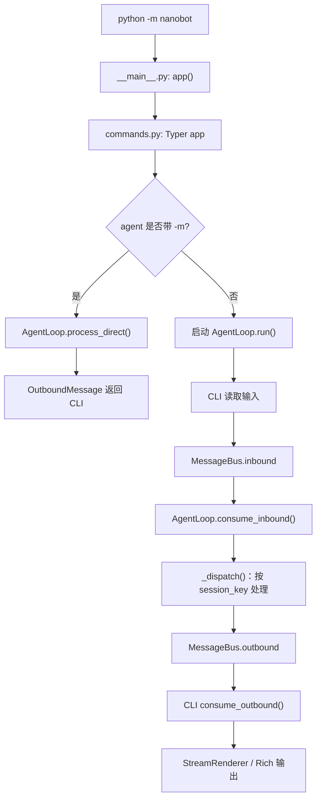

# CLI 入口与 MessageBus

> 学习阶段：阶段 1  
> 学习分支：`nanobot-learn`  
> 代码基线：`93571149`  
> 验证环境：`nanobot-learn-dev`  
> 验证日期：2026-07-21

## 1. 本阶段结论

nanobot 的 CLI 入口由 Typer 负责命令解析，但 CLI 并不等于 Agent 核心。
`commands.py` 负责把命令行参数转换为运行时对象、选择运行模式并负责终端渲染；
真正的 Agent 处理由 `AgentLoop` 完成。

`nanobot agent` 有两条重要路径：

```text
agent -m "问题"
    → AgentLoop.process_direct()
    → 直接返回 OutboundMessage

agent
    → MessageBus.publish_inbound()
    → AgentLoop.run() / _dispatch()
    → MessageBus.publish_outbound()
    → CLI 消费并渲染
```

因此，单次模式为了简单直接绕过 Bus；交互模式则使用与其他渠道相同的消息总线，
让 CLI 成为一个普通的消息生产者和响应消费者。

## 2. 需要回答的问题

- `python -m nanobot` 如何进入 Typer 应用？
- `app = typer.Typer(...)` 与 `@app.command()` 分别负责什么？
- `agent -m` 为什么不经过 MessageBus？
- 交互模式如何启动 AgentLoop、发布入站消息和消费出站消息？
- `InboundMessage` 和 `OutboundMessage` 如何表达路由与会话信息？
- MessageBus 为什么只维护两条队列，而不负责渠道路由？
- 流式增量、工具进度和最终响应为什么使用 `OutboundEvent`？

## 3. CLI 入口链路

### 3.1 Python 模块入口

`nanobot/__main__.py` 只有三步：

1. 从 `nanobot.cli.commands` 导入 `app`。
2. 判断当前模块是否作为脚本运行。
3. 调用 `app()`，把控制权交给 Typer。

对应源码：`nanobot/__main__.py:1-7`。

```python
from nanobot.cli.commands import app

if __name__ == "__main__":
    app()
```

这里的 `app()` 不是跳转到某个普通函数，而是 Typer 根据命令行参数，
在已注册的命令中选择目标函数。

### 3.2 Typer 应用和命令注册

`nanobot/cli/commands.py:222-227` 创建应用：

```python
app = typer.Typer(
    name="nanobot",
    context_settings={"help_option_names": ["-h", "--help"]},
    help=f"{__logo__} nanobot - Personal AI Assistant",
    no_args_is_help=True,
)
```

普通命令使用 `@app.command()` 注册，例如 `agent` 位于
`nanobot/cli/commands.py:2173-2174`。

Gateway 不是 `commands.py` 中的普通 `gateway()` 函数，而是通过
`app.add_typer(create_gateway_app(...), name="gateway")` 挂载子应用，
位置是 `nanobot/cli/commands.py:2153-2165`，工厂函数位于
`nanobot/cli/gateway.py:37`。

### 3.3 Windows 编码处理

CLI 在导入 Typer、Loguru 和 Rich 之前，先在
`nanobot/cli/commands.py:14-21` 尝试把 Windows 标准输出和错误输出调整为 UTF-8。
这说明 CLI 初始化顺序本身也是运行时行为的一部分：终端编码准备必须早于富文本和日志库导入。

## 4. `agent` 的两种运行模式

### 4.1 两种模式共用的初始化

`agent()` 位于 `nanobot/cli/commands.py:2174`，首先完成：

1. 解析 `message`、`session_id`、`workspace` 和 `config` 参数。
2. 调用 `_load_runtime_config()` 加载配置。
3. 调用 `sync_workspace_templates()` 同步工作区模板。
4. 创建一个 `MessageBus`。
5. 创建工作区范围的 `CronService`。
6. 调用 `AgentLoop.from_config(...)` 创建 AgentLoop。

因此，单次模式虽然不使用消息队列，但仍然使用同一个 AgentLoop 和运行时配置。

### 4.2 单次模式：`agent -m`

当 `message` 有值时，代码进入 `run_once()`，关键调用位于
`nanobot/cli/commands.py:2250-2277`：

1. 创建 `StreamRenderer`。
2. 调用 `agent_loop.process_direct(message, session_id, ...)`。
3. 由 `process_direct()` 返回一个 `OutboundMessage`。
4. 如果没有流式输出，CLI 直接渲染最终内容。
5. 关闭 MCP 资源。

`AgentLoop.process_direct()` 位于 `nanobot/agent/loop.py:1934`。
它会构造一个 `InboundMessage`，但随后直接调用内部处理流程，
不会把消息放入 `MessageBus.inbound`。

这条路径适合：

- 一次性命令。
- 脚本调用。
- 快速检查配置和 Provider。
- 不需要长期运行消息消费循环的场景。

### 4.3 交互模式：`agent`

当 `message` 为空时，代码进入交互模式，关键逻辑位于
`nanobot/cli/commands.py:2278-2420`：

1. 启动 `asyncio.create_task(agent_loop.run())`。
2. 启动 `_consume_outbound()` 任务，持续消费 `bus.outbound`。
3. 读取用户输入并处理 `exit`、`quit` 等退出命令。
4. 将输入封装为 `InboundMessage`。
5. 设置 `metadata={"_wants_stream": True}`，请求流式响应。
6. 调用 `bus.publish_inbound(...)` 发布消息。
7. 等待本轮响应完成，再继续读取下一条输入。

交互模式的 CLI 因而只负责两件事：

- 生产入站消息。
- 消费并渲染出站消息。

AgentLoop 的处理逻辑与 CLI 输入循环解耦。

## 5. 消息数据结构

### 5.1 `InboundMessage`

定义位置：`nanobot/bus/events.py:23-40`。

核心字段：

| 字段 | 用途 |
|---|---|
| `channel` | 消息来源渠道，例如 `cli`、`websocket` |
| `sender_id` | 发送者标识 |
| `chat_id` | 聊天或频道标识 |
| `content` | 文本内容 |
| `timestamp` | 消息时间 |
| `media` | 媒体引用列表 |
| `metadata` | 渠道或运行时附加信息 |
| `session_key_override` | 可选的会话键覆盖值 |

`session_key` 属性默认返回：

```text
{channel}:{chat_id}
```

如果存在 `session_key_override`，则优先使用覆盖值。会话键是后续 AgentLoop
实现会话隔离、锁和并发控制的基础。

### 5.2 `OutboundMessage`

定义位置：`nanobot/bus/events.py:42-60`。

它同时携带两类信息：

1. **渠道路由信息**：`channel`、`chat_id`、`reply_to`、`metadata`。
2. **用户或 UI 内容**：`content`、`media`、`buttons` 和可选的 `event`。

其中 `event` 用于承载流式、进度、重试、回合结束等结构化运行时语义；
普通文本仍然放在 `content` 中。

### 5.3 `OutboundEvent`

定义位置：`nanobot/bus/outbound_events.py`。

当前可见的事件包括：

- `ProgressEvent`：工具提示、推理和文件编辑进度。
- `RetryWaitEvent`：重试等待。
- `StreamDeltaEvent`：流式文本增量。
- `StreamEndEvent`：流式片段结束。
- `StreamedResponseEvent`：最终流式响应。
- `TurnEndEvent`：回合完成。
- `GoalStatusEvent`、`SessionUpdatedEvent` 等运行时状态事件。

设计上，Bus 仍然传输完整的 `OutboundMessage`，因为渠道需要路由字段；
结构化事件则通过 `event` 字段表达，不把运行时语义全部塞进路由元数据。

## 6. MessageBus 的职责边界

定义位置：`nanobot/bus/queue.py:8-38`。

`MessageBus` 只有两条异步队列：

```text
inbound  ：渠道 → AgentLoop
outbound ：AgentLoop → 渠道
```

四个核心方法：

| 方法 | 方向 | 行为 |
|---|---|---|
| `publish_inbound()` | 生产入站 | 将 `InboundMessage` 放入 inbound 队列 |
| `consume_inbound()` | 消费入站 | 等待并取出一条入站消息 |
| `publish_outbound()` | 生产出站 | 将 `OutboundMessage` 放入 outbound 队列 |
| `consume_outbound()` | 消费出站 | 等待并取出一条出站消息 |

Bus 还提供 `inbound_size` 和 `outbound_size`，用于查看队列中的待处理数量。

### 6.1 Bus 不负责路由

MessageBus 不知道 Telegram、CLI、WebSocket 等渠道的存在，也不根据渠道名称调用发送方法。
它只负责传输消息；真正的渠道路由发生在消息消费者一侧。

这带来两个直接结果：

- 新增渠道不需要修改 Bus。
- AgentLoop 可以在不依赖具体 UI 的情况下处理消息。

这是一个基于依赖注入的事实单例：CLI 或 Gateway 创建一个 Bus，
再把同一个引用传给 AgentLoop 和渠道管理器。

## 7. AgentLoop 与 Bus 的连接

### 7.1 主消费循环

`AgentLoop.run()` 位于 `nanobot/agent/loop.py:1018-1117`：

1. 设置 `_running = True`。
2. 连接 MCP 等运行时资源。
3. 使用 `bus.consume_inbound()` 等待入站消息。
4. 每秒超时时检查自动压缩任务，然后继续等待。
5. 处理运行时控制消息和高优先级命令。
6. 为普通消息创建 `_dispatch()` 任务。
7. 在退出时关闭 MCP 资源。

### 7.2 每会话分发

`AgentLoop._dispatch()` 位于 `nanobot/agent/loop.py:1119-1195`。
它以 `session_key` 为粒度建立锁：

- 同一会话内串行处理，避免上下文同时写入。
- 不同会话可以并发处理。
- 每个活动回合创建 pending queue，用于处理中途插入的消息。
- 当入站消息带有 `_wants_stream` 时，向 outbound 队列发布
  `StreamDeltaEvent` 和 `StreamEndEvent`。
- 回合完成后发布最终 `OutboundMessage`。

因此，MessageBus 提供的是传输边界，真正的会话并发语义由 AgentLoop 实现。

## 8. 主流程图



## 9. 测试与运行证据

### 9.1 CLI 验证

在 `nanobot-learn-dev` 环境中执行：

```powershell
python -m nanobot --help
```

结果：退出码 `0`，能够列出 `onboard`、`agent`、`gateway`、`serve`、`webui` 等命令。

### 9.2 Bus 定向测试

执行：

```powershell
python -m pytest tests\bus\test_outbound_events.py tests\bus\test_runtime_events.py -q
```

结果：`13 passed`。

这些测试验证了：

- 出站事件存放在 `OutboundMessage.event`。
- 普通消息可以没有运行时事件。
- 旧版 metadata 标记仍可转换为结构化事件。
- 替换事件时保留渠道路由 metadata。
- RuntimeEventBus 按事件类型过滤订阅者。
- RuntimeEventPublisher 能从入站消息构造会话上下文。

## 10. 建议复现实验

以下实验不需要 Provider、API Key 或真实模型：

```python
import asyncio

from nanobot.bus.events import InboundMessage, OutboundMessage
from nanobot.bus.queue import MessageBus


async def main() -> None:
    bus = MessageBus()
    inbound = InboundMessage(
        channel="cli",
        sender_id="user",
        chat_id="direct",
        content="hello",
    )
    await bus.publish_inbound(inbound)
    received = await bus.consume_inbound()
    assert received.session_key == "cli:direct"

    await bus.publish_outbound(
        OutboundMessage(
            channel=received.channel,
            chat_id=received.chat_id,
            content="ack",
        )
    )
    response = await bus.consume_outbound()
    assert response.content == "ack"
    print(response.channel, response.chat_id, response.content)


asyncio.run(main())
```

观察重点：Bus 不会主动调用任何渠道，也不会修改 `session_key`；它只负责队列传输。

## 11. 本阶段验收

- [x] 能解释 `python -m nanobot` 到 Typer `app()` 的入口链路。
- [x] 能区分 `agent -m` 的直连路径和交互模式的 Bus 路径。
- [x] 能说明 `InboundMessage.session_key` 的默认生成规则。
- [x] 能说明 MessageBus 的两条队列和四个核心方法。
- [x] 能说明 OutboundMessage 的路由字段与 OutboundEvent 的职责差异。
- [x] 已运行 CLI 帮助和 13 个 Bus 相关定向测试。
- [x] 建议复现实验通过，输出 `cli direct ack`。

## 12. 遗留问题

- `ChannelManager` 在哪里消费 outbound 并按 `msg.channel` 路由？留到阶段 6。
- `AgentLoop._process_message()` 如何构建上下文并调用 Runner？留到阶段 2。
- `_wants_stream` 如何影响 Runner 的流式回调？在阶段 3 继续追踪。
- `RuntimeEventBus` 与 `MessageBus` 为什么并存？后续结合 AgentLoop 和 WebUI 继续分析。

