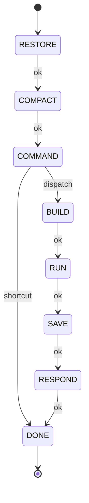
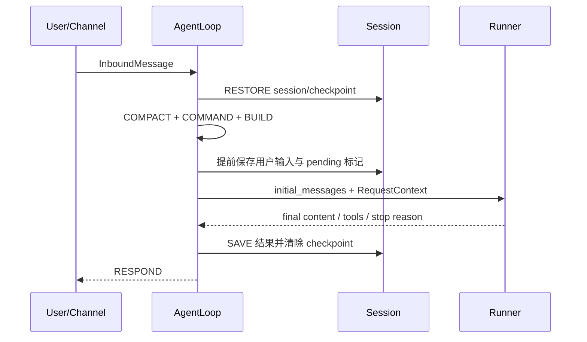

# Step02：AgentLoop 状态机与上下文构建

## 1. 学习目标

本阶段只阅读源码和运行隔离测试，不调用真实模型，也不修改 nanobot业务代码。

需要回答四个问题：

1. 一条消息如何进入 `AgentLoop`，又如何被同会话串行处理？
2. 一个 Turn 包含哪些状态，各状态之间怎样转换？
3. 系统提示词、历史消息、运行时上下文和当前输入如何组合？
4. 命令短路、中途注入、取消和运行时检查点如何参与 Turn 生命周期？

## 2. 阅读基线

| 项目 | 内容 |
|---|---|
| 学习日期 | 2026-07-21 |
| 学习分支 | `nanobot-learn` |
| 代码基线 | `93571149` |
| Python 环境 | `nanobot-learn-dev`，Python 3.12.13 |
| 核心源码 | `nanobot/agent/loop.py` |
| 上下文源码 | `nanobot/agent/context.py` |
| 命令源码 | `nanobot/command/router.py`、`nanobot/command/builtin.py` |
| Turn 扩展 | `nanobot/agent/turn_hooks.py` |

> 文中的“设计意图”是基于当前源码结构得出的学习性归纳，不代表项目作者的官方表述。后续将在 Step08 统一整理架构、设计模式与设计哲学。

## 3. 核心结论

`AgentLoop` 不只是一个无限循环，它是 nanobot 的 Turn 编排器。它负责消息准入、会话路由、并发控制、状态推进、上下文构建、生命周期持久化和结果投递；真正的模型调用与工具循环则由 Runner 承担。

可以先记住这条边界：

```text
AgentLoop = 何时执行、为谁执行、用什么上下文执行、结果保存和发到哪里
Runner    = 如何调用模型、如何执行工具、何时结束模型—工具循环
```

单个 Turn 的主状态链如下：



其中，命令是唯一能在常规模型执行前直接短路到 `DONE` 的主路径。

## 4. AgentLoop 的职责边界

### 4.1 AgentLoop 负责什么

从 `loop.py` 可以归纳出以下职责：

- 从 `MessageBus` 接收 `InboundMessage`。
- 识别控制事件、优先命令、普通命令和普通消息。
- 计算有效 `session_key` 和消息响应路由。
- 保证同一会话串行，不同会话可以并发。
- 将活动会话收到的新消息放入待处理队列，供当前 Turn 中途注入。
- 创建并推进 `TurnContext` 状态机。
- 恢复与保存 Session、运行时检查点和待处理用户消息。
- 构建 Runner 所需的初始消息与执行上下文。
- 将最终内容封装为出站消息并发布。

### 4.2 Runner 负责什么

在 `RUN` 状态中，`AgentLoop` 通过 `_run_agent_loop` 进入 Runner 边界。
Runner 负责模型和工具之间的迭代执行，返回最终内容、工具调用结果、完整消息和
停止原因。

Step02 只确认这条边界，不深入 Runner 内部算法。模型—工具循环将在 Step03
单独分析。

### 4.3 为什么要分开

这类分层让“会话生命周期”和“模型推理循环”可以相对独立：

- Loop 可以统一服务 CLI、Channel、子 Agent 回传和系统消息。
- Runner 不必理解消息最终应该发往哪个 Channel。
- Session 保存、压缩和取消不需要散落到 Provider 或 Tool 中。
- 测试可以用 Fake Runner 验证 Turn，而不必访问真实模型。

这是对源码职责划分的归纳，不是额外引入的新抽象。

## 5. 从消息进入到开始执行

### 5.1 `run()`：消息准入层

`AgentLoop.run()` 持续消费 Bus 的入站消息。收到消息后，它不会立刻无条件创建
一个新 Turn，而是按顺序处理几类情况：

1. 识别运行时控制事件。
2. 在会话锁外处理 `/stop`、`/restart`、`/status` 等优先命令。
3. 判断自动化 Turn 是否需要延后。
4. 如果同一会话已有活动 Turn：
   - 可直接分发的非优先命令按命令路径处理；
   - 普通消息进入该会话的 pending queue，作为中途注入候选。
5. 如果会话空闲，则创建 `_dispatch()` 异步任务。

优先命令位于会话锁外非常关键。例如当前 Turn 正在占用会话锁时，`/stop`
仍需要及时取消它；若 `/stop` 也等待同一把锁，就会失去“停止当前任务”的意义。

### 5.2 `_dispatch()`：并发边界

`_dispatch()` 使用按 `session_key` 划分的 `asyncio.Lock`：

```text
session A: Turn A1 -> Turn A2 -> Turn A3
session B: Turn B1 -> Turn B2

A 与 B 可以并发；A1、A2、A3 必须串行。
```

除会话锁外，Loop 还可以使用全局并发门限制总执行量。进入执行区后，它会：

1. 为当前会话准备有界 pending queue。
2. 创建流式输出相关回调。
3. 调用 `_process_message()` 推进完整 Turn。
4. 发布返回的出站消息。
5. 清理活动任务与会话级临时状态。

pending queue 有容量限制，说明中途注入是一条受控通道，而不是无限积压的第二个
消息总线。

### 5.3 `process_direct()` 不是另一套执行引擎

CLI direct 等直接调用路径最终同样进入 `_process_message()`，并使用相同的
会话锁。因此 direct 模式绕过的是外部 Channel 往返，不是 Turn 状态机本身。

## 6. TurnContext：一次执行的状态载体

`TurnContext` 将原本可能散落在多个函数参数中的 Turn 数据集中保存。主要字段可
按用途分组：

| 分组 | 代表字段 | 用途 |
|---|---|---|
| 标识 | `msg`、`session_key`、`turn_id`、`kind` | 标识消息和 Turn |
| 路由 | `route` | 区分执行输入和响应投递位置 |
| 状态 | `state` | 指示当前状态机节点 |
| 历史与输入 | `history`、`initial_messages` | 提供给模型的消息序列 |
| 执行上下文 | `request_context`、`runtime_context_blocks` | 支撑工具执行和模型可见上下文 |
| 执行结果 | `final_content`、`tools_used`、`all_messages` | 保存 Runner 返回值 |
| 控制 | pending queue、callbacks、hooks、scopes | 注入、流式回调和扩展点 |
| 持久化 | save/outbound 标志、checkpoint 信息 | 控制保存和响应行为 |
| 可观测性 | timing、trace、`stop_reason` | 记录状态耗时和结束原因 |

`TurnContext` 不是长期会话对象。Session 跨多个 Turn 持久存在，而
`TurnContext` 只描述当前一次执行。

## 7. 状态机逐步拆解

`_process_message()` 创建初始状态为 `RESTORE` 的 `TurnContext`，然后按当前状态
动态寻找 `_state_<name>` 处理器。处理器返回事件，转换表根据
`(当前状态, 事件)` 决定下一状态。

这不是散落的 `if/elif` 跳转：合法转换集中定义，缺失转换会抛出错误，而且每个
状态的耗时会写入 trace。

### 7.1 RESTORE：恢复执行现场

主要工作：

- 预处理媒体或文档输入。
- 获取或创建 Session。
- 记录用户侧运行时事件。
- 恢复工作区范围、运行时检查点和尚未完成的用户 Turn。

这一步把“恢复旧状态”放在“构建新上下文”之前，避免后面的 Builder 看到不完整
的 Session。

### 7.2 COMPACT：控制历史体积

`auto_compact.prepare_session()` 在模型输入构建前检查 Session，必要时准备摘要。
生成的待保存摘要被带到后续状态。

压缩不是 Runner 工具循环的一部分，而是 Turn 的前置生命周期动作。具体压缩与
记忆策略将在 Step04 继续学习。

### 7.3 COMMAND：命令分流与短路

普通用户消息会构造 `CommandContext` 并交给命令路由器：

- 没有匹配命令：返回 `dispatch`，进入 `BUILD`。
- 匹配并得到结果：构造出站响应，返回 `shortcut`，直接进入 `DONE`。
- SYSTEM Turn：绕过用户命令分发，继续进入 `BUILD`。

命令短路意味着 `/help`、`/model` 等管理动作通常不需要消耗一次模型调用。

### 7.4 BUILD：生成 Runner 输入

这是上下文汇合最集中的状态，主要步骤包括：

1. 处理历史回放预算和必要的记忆整合。
2. 读取 Session 历史。
3. 构造 `RequestContext`。
4. 解析本 Turn 的运行时上下文块。
5. 调用 `ContextBuilder` 生成初始消息。
6. 提前持久化本次用户消息。
7. 构建进度、重试和流式输出回调。

运行时上下文在一个 Turn 中只解析一次，避免不同组件重复解析后得到不一致结果。

### 7.5 RUN：跨入 Runner 边界

该状态先发出 running 状态，然后调用模型—工具循环，并收集：

- 最终文本；
- 使用过的工具；
- Runner 产生的完整消息；
- 停止原因；
- continuation 等控制信息。

Step03 将从这里继续向下追踪 Provider 响应、工具调用和停止条件。

### 7.6 SAVE：提交 Turn 结果

主要工作：

- 准备保存边界和空响应兜底。
- 保存用户与助手消息及相关运行信息。
- 记录延迟。
- 执行容量约束或后台整合。
- 清除已完成的 pending user turn 和运行时检查点。
- 保存 Session。

用户消息在 BUILD 阶段提前保存，而成功完成后的清理位于 SAVE，这为中断恢复提供
了基础。

### 7.7 RESPOND：组装对外响应

该状态根据 route 和响应标志决定：

- 是否抑制响应；
- SYSTEM Turn 是否直接返回；
- 用户 Turn 如何组装 `OutboundMessage`；
- 是否附加临时停止原因等信息。

执行输入与响应位置由 `TurnRoute` 分离，避免把 Channel 路由规则混入 Runner。

### 7.8 DONE：终止当前状态机

`DONE` 表示本 Turn 的状态推进结束。它既可能来自完整的
`BUILD -> RUN -> SAVE -> RESPOND`，也可能来自 COMMAND 短路。

## 8. 命令路由与取消

### 8.1 三种匹配层级

`CommandRouter` 包含三类注册和分发方式：

| 类型 | 典型用途 | 特点 |
|---|---|---|
| priority exact | `/stop`、`/restart`、`/status` | 在常规 dispatch 和会话锁之前处理 |
| exact | 固定命令 | 在 Turn 的命令阶段精确匹配 |
| prefix | 带参数命令 | 最长前缀优先，避免短前缀抢占 |

路由匹配忽略大小写，并在边界归一化 `/command@bot` 形式，同时保留参数。

### 8.2 `/stop` 为什么还要清空 pending queue

`/stop` 不只取消活动任务和子 Agent，还会排空当前会话的 pending queue。

原因是：等待中的注入消息可能正依赖活动 Turn 消费。若只取消任务而保留队列，
这些消息会成为失去消费者的残留状态，甚至导致后续注入路径等待或混淆下一 Turn。

### 8.3 中途注入

当同一会话正在运行时，新普通消息不会再启动一个并发 Turn，而会进入有界队列。
Runner 可在合适的边界读取这些消息并将其注入当前执行。

因此，同会话消息有两种处理方式：

```text
会话空闲 -> 创建新 Turn
会话忙碌 -> 进入 pending queue，等待当前 Turn 消费或后续处理
```

注入的具体消费位置属于 Step03 Runner 学习范围。

## 9. ContextBuilder：模型到底看到了什么

### 9.1 系统提示词的组成顺序

`ContextBuilder.build_system_prompt()` 按当前源码大致组合：

1. Agent 身份、运行环境、工作区、平台和 Channel 信息。
2. 工作区引导文件：`AGENTS.md`、`SOUL.md`、`USER.md`。
3. 内置工具使用约定。
4. 非模板化记忆。
5. always-load skills 的完整内容。
6. 可用 skills 摘要。
7. 最近历史摘要。
8. 已归档的 Session 摘要。

各部分使用清晰分隔符连接。顺序具有语义：长期规则与工具约定位于近期历史之前，
当前用户输入则不塞进系统提示词，而作为消息列表中的 user message。

### 9.2 `build_messages()` 的结果

最终消息结构可简化为：

```text
[
  {role: system, content: system_prompt},
  ...session_history,
  {role: user, content: current_input + runtime_context_blocks}
]
```

实际实现还包含以下处理：

- 有效图片会编码成模型可消费的多模态内容块，并保留路径元数据。
- 如果当前消息与历史末尾角色相同，会合并内容，避免连续同角色消息造成
  Provider 兼容问题。
- runtime context blocks 只注入当前 user 输入，并携带内部来源元数据。
- SYSTEM 类型 Turn 会按其角色规则构建消息，不强行伪装成用户输入。

### 9.3 三类“上下文”不要混淆

| 对象 | 谁消费 | 作用 |
|---|---|---|
| System Prompt | 模型 | 身份、规则、工具约定、技能与摘要 |
| Runtime Context Block | 模型 | 本 Turn 临时可见的业务或运行信息 |
| RequestContext | Tool/运行时 | channel、chat、message、session、sender、turn、workspace 等执行元数据 |

`RuntimeContextBlock` 是模型输入内容；`RequestContext` 更像工具执行环境。二者都在
BUILD 阶段产生，但用途和可见范围不同。

## 10. 提前持久化、检查点与恢复

用户输入在模型执行前就会被写入 Session，并标记 pending user turn。这样即使
Runner 被停止或进程在执行中断开，下一 Turn 仍有机会恢复用户请求和运行时现场。

成功完成 SAVE 后，再清理 pending 标记和运行时检查点。生命周期可以概括为：



若执行被 `/stop` 取消，相关测试表明运行时检查点会保留给下一 Turn，而不是被当作
成功完成后清除。

## 11. Turn Hooks 与扩展边界

`turn_hooks.py` 提供按 Turn 绑定的 hook/factory/scope 机制，使扩展逻辑可以在
明确生命周期内参与执行和清理。Step02 只确认其位于 Turn 编排层，不展开具体扩展
协议；安全边界和扩展机制将在 Step07 统一分析。

## 12. 源码体现的设计模式线索

以下内容先作为 Step08 的素材，不在本阶段下最终结论：

| 线索 | 源码证据 | 初步理解 |
|---|---|---|
| 显式状态机 | `TurnState`、转换表、状态处理器 | 让 Turn 流程可验证、可观测 |
| Command | 命令注册、匹配、`CommandContext` | 把管理操作与模型对话分流 |
| Builder | `ContextBuilder` | 集中构建复杂模型输入 |
| Facade/Orchestrator | `AgentLoop` | 对外统一协调 Bus、Session、Runner |
| Strategy/Provider | Runner 调用抽象 Provider | 模型实现可替换，Step05 深入 |
| Unit of Work 线索 | RESTORE/BUILD/SAVE 边界 | Turn 作为一次有提交点的工作单元 |
| Scoped Context | `TurnContext`、`RequestContext` | 控制状态和执行元数据的生命周期 |

“模式名称”是为帮助学习而做的映射；最终应以职责、边界和变化原因优先，不为了
套模式而套模式。

## 13. 验证记录

### 13.1 定向测试

第一组覆盖上下文构建、命令路由、停止队列、工具上下文隔离和 SYSTEM Turn
状态序列：

```powershell
C:\Users\xkrit\anaconda3\envs\nanobot-learn-dev\python.exe -m pytest `
  tests\agent\test_context_builder.py `
  tests\command\test_router_dispatchable.py `
  tests\command\test_stop_pending_queue.py `
  tests\agent\test_loop_tool_context.py `
  'tests\agent\test_loop_save_turn.py::test_system_subagent_followup_uses_common_turn_state_machine' `
  -q
```

结果：`62 passed in 2.32s`。

第二组覆盖停止后的上下文与检查点保留：

```powershell
C:\Users\xkrit\anaconda3\envs\nanobot-learn-dev\python.exe -m pytest `
  tests\agent\test_stop_preserves_context.py `
  'tests\agent\test_loop_save_turn.py::test_stop_preserves_runtime_checkpoint_for_next_turn' `
  -q
```

结果：`5 passed in 0.57s`。

本阶段合计：`67 passed`。

### 13.2 ContextBuilder 隔离实验

使用临时工作区提供 `AGENTS.md`，加入一条 assistant 历史、当前 user 输入和来源为
`study` 的运行时上下文块。实验输出：

```text
roles=system,assistant,user
has_agents=True
has_tool_contract=True
user_has_runtime=True
runtime_sources=['study']
```

这说明：

- 系统提示词包含工作区规则和工具约定；
- 历史消息位于 system 与当前 user 输入之间；
- 运行时上下文进入当前 user 内容，并保留来源元数据。

实验只使用临时目录，没有在仓库中生成脚本或测试文件。

## 14. Step02 验收

- [x] 能说明一条消息从 Bus/direct 进入 Turn 的主要路径。
- [x] 能画出 `RESTORE -> ... -> DONE` 状态转换图。
- [x] 能解释同会话串行、跨会话并发和中途注入。
- [x] 能解释 COMMAND 短路与 priority command 的区别。
- [x] 能列出系统提示词和模型消息的主要组成部分。
- [x] 能区分 System Prompt、Runtime Context Block 和 RequestContext。
- [x] 能说明 Loop 与 Runner 的职责边界。
- [x] 定向测试全部通过，且未调用真实模型。

Step02 验收完成。

## 15. 留给后续阶段的问题

1. Runner 如何识别模型工具调用并继续下一轮？——Step03。
2. pending queue 在 Runner 的什么时机被读取并注入？——Step03。
3. Session history、memory 与 compact summary 如何共同控制长期上下文？——Step04。
4. Provider 如何把统一消息转换为不同模型协议？——Step05。
5. Channel 的 thread/chat 路由如何影响 `TurnRoute`？——Step06。
6. Hook、MCP 和技能扩展怎样限制能力边界？——Step07。

