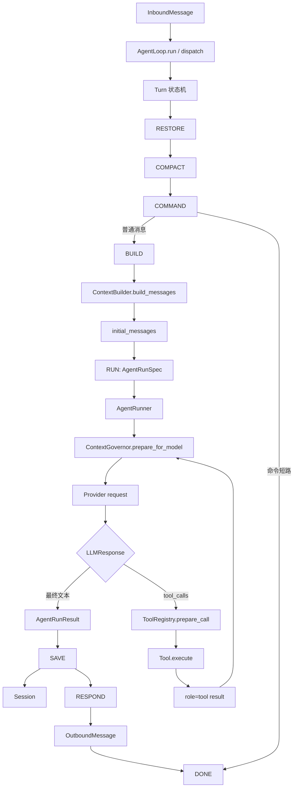
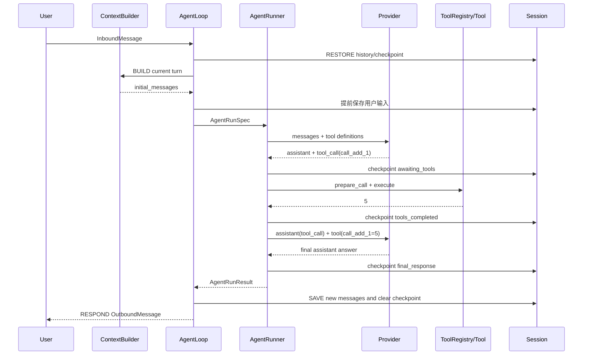

# Step03：AgentRunner、工具循环与核心执行链

## 1. 学习目标

本阶段在 [Step02](./02-agent-loop-and-context.md) 的 Turn 状态机基础上，继续进入
`RUN` 状态，把 Context、AgentLoop、AgentRunner 和 Tool 串成一条完整链路。

需要回答以下问题：

1. ContextBuilder 生成的消息怎样进入 Runner？
2. Runner 如何请求 Provider，并判断应该回答还是调用工具？
3. 工具名称、参数 JSON Schema 和 `tool_call_id` 如何形成执行契约？
4. 工具结果怎样回填消息，再触发下一次模型请求？
5. 中途注入、空响应、超长响应、模型错误和最大迭代如何结束或恢复循环？
6. AgentLoop、Turn 状态机与 Runner 循环为什么是三层不同的“循环”？

本阶段仍然只阅读源码、运行 Fake/Mock 实验和定向测试：

- 不调用真实模型；
- 不访问外部 API；
- 不修改 nanobot 业务源码；
- 不新增持久化实验脚本。

## 2. 阅读与验证基线

| 项目 | 内容 |
|---|---|
| 学习日期 | 2026-07-22 |
| 学习分支 | `nanobot-learn` |
| 代码基线 | `93571149` |
| Python 环境 | `nanobot-learn-dev`，Python 3.12.13 |
| 上下文入口 | `nanobot/agent/context.py` |
| Turn 编排 | `nanobot/agent/loop.py` |
| Runner | `nanobot/agent/runner.py` |
| 上下文治理 | `nanobot/agent/context_governance.py` |
| Provider 契约 | `nanobot/providers/base.py` |
| Tool 契约 | `nanobot/agent/tools/base.py` |
| Tool 注册与执行 | `nanobot/agent/tools/registry.py` |
| Tool 发现 | `nanobot/agent/tools/loader.py` |
| Tool Schema | `nanobot/agent/tools/schema.py` |

> 本文将源码直接体现的行为标记为“源码事实”；对职责划分和设计模式的解释属于
> “学习理解”，最终会在 Step08 统一复盘。

## 3. 先建立整体心智模型

### 3.1 三层不同的“循环”

nanobot 核心路径中至少有三层容易混淆的循环：

| 层级 | 入口 | 循环对象 | 结束条件 |
|---|---|---|---|
| 服务循环 | `AgentLoop.run()` | 不断接收 Bus 消息 | AgentLoop 停止 |
| Turn 状态机 | `_process_message()` | 当前消息的生命周期状态 | 到达 `DONE` |
| Runner 迭代 | `AgentRunner._run_core()` | 模型请求与工具执行 | 得到最终回答或触发停止条件 |

可以这样理解：

```text
AgentLoop.run()                   长期运行，接收很多消息
  └─ _process_message(msg)        处理其中一条消息
       └─ RESTORE ... RUN ...     推进这条消息的 Turn 状态
                    └─ Runner     一个 Turn 内可能调用模型和工具多轮
```

Runner 中的一次 iteration 不是一个新 Turn。多轮工具调用仍然属于同一个用户
Turn，直到 Runner 返回 `AgentRunResult`，AgentLoop 才进入 `SAVE`。

### 3.2 一句话职责边界

```text
ContextBuilder：决定初始时“给模型看什么”
AgentLoop：决定一次 Turn “何时、为谁、以什么边界执行和保存”
AgentRunner：决定模型和工具“怎样迭代、恢复和停止”
Provider：把统一模型请求适配到具体模型服务
ToolRegistry：把模型声明的工具调用安全地解析、校验并执行
```

### 3.3 核心全景图



## 4. “Context”在核心链中有多种含义

阅读源码时，不要把所有叫 context 的对象都理解成提示词。

| 对象 | 生命周期 | 主要消费者 | 作用 |
|---|---|---|---|
| Session history | 跨 Turn | ContextBuilder、Session | 持久化对话历史 |
| System Prompt | 当前模型输入 | 模型 | 身份、规则、工具约定、技能与记忆 |
| RuntimeContextBlock | 当前 Turn | 模型 | 临时业务/运行信息 |
| `TurnContext` | 当前 Turn | AgentLoop 状态机 | 保存状态、路由、输入、结果与回调 |
| `RequestContext` | 当前 Turn | Tool/运行时 | channel、session、workspace 等执行元数据 |
| `AgentHookContext` | 当前 iteration | Hook | 模型响应、工具调用、流式进度等观察数据 |
| model message copy | 当前模型请求 | Provider | 经 ContextGovernor 修复、裁剪后的请求副本 |

其中最重要的两个区别是：

1. `RuntimeContextBlock` 会进入模型可见消息。
2. `RequestContext` 通过 ContextVar 绑定，主要供 Tool 和运行时读取。

## 5. 第一段：ContextBuilder 生成初始消息

### 5.1 BUILD 状态做什么

`AgentLoop._state_build()` 在进入 Runner 前完成：

1. 计算历史回放消息数与 Token 预算。
2. 必要时触发会话整合。
3. 从 Session 获取历史消息。
4. 创建 `RequestContext`。
5. 为用户 Turn 解析一次 `RuntimeContextBlock`。
6. 调用 `ContextBuilder` 生成 `initial_messages`。
7. 提前持久化当前用户消息和 pending 标记。
8. 准备进度、重试和流式回调。

运行时上下文只在 BUILD 阶段解析一次。Runner 即使执行多轮，也复用同一份初始
上下文，不会在每次模型请求前重新调用 RuntimeContextProvider。

### 5.2 `initial_messages` 的基本形态

无工具调用前，消息通常是：

```text
system: 身份 + AGENTS/SOUL/USER + 工具约定 + 技能 + 记忆/摘要
...历史 user/assistant 消息...
user: 当前输入 + RuntimeContextBlock
```

对应的简化数据结构：

```python
[
    {"role": "system", "content": "..."},
    {"role": "user", "content": "上一轮问题"},
    {"role": "assistant", "content": "上一轮回答"},
    {"role": "user", "content": "当前问题\n\n<runtime-context>...</runtime-context>"},
]
```

多模态输入会使用内容块；连续相同角色会在 ContextBuilder 边界合并。详细规则见
[Step02](./02-agent-loop-and-context.md)。

## 6. 第二段：AgentLoop 把 Turn 交给 Runner

### 6.1 RUN 状态的输入输出

`_state_run()` 把 BUILD 产物传入 `_run_agent_loop()`：

- `initial_messages`；
- 本 Turn 固定的 `LLMRuntime`；
- Session、Channel 和消息路由信息；
- `RequestContext`；
- ToolRegistry；
- pending queue；
- 流式、进度、重试回调；
- Hook、Hook Factory 和 Turn Scope。

Runner 返回五个 AgentLoop 关心的结果：

```text
final_content
tools_used
all_messages
stop_reason
had_injections
```

这些结果被写回 `TurnContext`，然后状态机继续进入 `SAVE`。

### 6.2 `LLMRuntime` 为什么是冻结快照

`LLMRuntime` 固定当前 Turn 使用的：

- Provider；
- model；
- temperature、max_tokens、reasoning_effort；
- context window；
- model preset 与配置签名。

它是冻结的数据类。学习理解：模型配置在 Turn 准入时被捕获，可以避免 Runner
执行到一半时因全局模型设置变化而混用不同配置。

### 6.3 AgentLoop 提供给 Runner 的桥接回调

AgentLoop 没有把 Session 和 Bus 的所有细节塞进 Runner，而是传入回调：

| 回调 | AgentLoop 一侧职责 | Runner 调用时机 |
|---|---|---|
| checkpoint | 写 Session runtime checkpoint | 等待工具、工具完成、最终响应 |
| injection | 从本会话 pending queue 取消息 | 工具后、最终回答后、异常后等 |
| progress/stream | 转发 Channel 进度和增量文本 | 模型请求与工具生命周期 |
| retry wait | 告知 Channel Provider 正在重试 | Provider 重试等待 |

这是 Loop 与 Runner 解耦的重要位置：Runner 知道“需要检查点或新消息”，但不直接
操作 MessageBus 或 SessionManager。

### 6.4 Turn 级执行上下文绑定

进入 Runner 前，AgentLoop 会绑定：

- file state；
- `RequestContext`；
- workspace scope；
- Turn scopes。

这些上下文在 Runner 结束后通过 `finally` 复位。工具因此可以读取当前 Turn 的
权威上下文，同时避免不同并发会话之间相互污染。

## 7. AgentRunSpec 与 AgentRunResult

### 7.1 AgentRunSpec：Runner 的完整输入契约

`AgentRunSpec` 主要字段可分为：

| 分类 | 字段示例 | 作用 |
|---|---|---|
| 模型输入 | `initial_messages`、`runtime` | 固定初始消息和模型运行快照 |
| 工具 | `tools`、`concurrent_tools` | 工具定义与执行策略 |
| 预算 | `max_iterations`、`max_tool_result_chars` | 限制循环和工具结果规模 |
| 生命周期 | `hook`、checkpoint/injection callbacks | 插入进度、持久化和注入逻辑 |
| 安全范围 | `workspace`、`session_key` | 上下文治理和工具边界 |
| 恢复策略 | timeout、retry mode、finalize flags | 控制异常和预算耗尽后的行为 |

`AgentRunSpec` 表示“一次 Runner 执行所需的全部条件”，但不包含 Channel 产品层
的具体发送逻辑。

### 7.2 AgentRunResult：Runner 的统一输出

`AgentRunResult` 包含：

- `final_content`：最终对用户可见的文本候选；
- `messages`：本次 Runner 结束后的完整消息序列；
- `tools_used`：成功执行的工具名称；
- `usage`：累计 Token 使用量；
- `stop_reason`：循环停止原因；
- `error`：错误详情；
- `tool_events`：工具执行的结构化摘要；
- `had_injections`：是否消费过中途注入。

AgentLoop 只从中选择 Turn 后续状态需要的数据，不需要理解 Runner 内部每个分支。

## 8. 第三段：Runner 的模型—工具循环

### 8.1 主循环伪流程

以下流程是对 `_run_core()` 的等价结构化描述，不是新增实现：

```text
for iteration in range(max_iterations):
    messages_for_model = ContextGovernor.prepare_for_model(messages)
    response = request_provider(messages_for_model, tool_definitions)
    累计 usage，提取 reasoning

    if response.should_execute_tools:
        append assistant(tool_calls)
        checkpoint(awaiting_tools)
        execute tools
        append tool results
        checkpoint(tools_completed)
        drain pending injections
        continue

    尝试恢复空响应或被截断响应
    drain pending injections
    处理模型错误或空最终回答
    append assistant(final answer)
    checkpoint(final_response)
    break
else:
    stop_reason = max_iterations
    尝试一次禁止工具的最终总结
    失败则使用固定兜底文本
```

### 8.2 每一轮不是直接使用原始 messages

Runner 维护的 `messages` 是本 Turn 的真实执行消息；每次请求模型前，
`ContextGovernor.prepare_for_model()` 会生成模型请求副本并进行：

- 移除孤立的 tool result；
- 为缺失的 tool result 补全错误结果；
- 控制工具结果体积；
- 在上下文超限时压缩 in-flight 工具结果；
- 再次修复工具调用和工具结果的配对关系。

源码明确要求这些合成修复不能改变最终持久化边界。因此：

```text
messages           = Runner 的真实执行记录，最终交给 AgentLoop 保存
messages_for_model = 当前 iteration 的受控请求副本，只发给 Provider
```

这是“ContextBuilder 构建初始上下文”和“ContextGovernor 每轮治理上下文”的区别。

### 8.3 Provider 请求包含什么

`_build_request_kwargs()` 主要传递：

- messages；
- `ToolRegistry.get_definitions()` 返回的工具定义；
- model；
- temperature、max_tokens、reasoning_effort；
- retry mode 与重试等待回调。

根据 Hook 和 Provider 能力，Runner 会选择：

1. 完整流式请求；
2. 只把流式增量用于进度展示；
3. 普通非流式请求。

Runner 还提供有限的外层超时，防止挂起的模型请求长期占用同会话锁。默认超时可由
`NANOBOT_LLM_TIMEOUT_S` 调整，设为 `0` 可关闭该外层限制。

## 9. Provider 响应契约

### 9.1 `LLMResponse`

统一响应包含：

```text
content
tool_calls
finish_reason
usage
reasoning_content / thinking_blocks
结构化错误信息
```

Runner 不直接解析某家模型的原始 HTTP 响应；Provider 先将其转换为
`LLMResponse`。

### 9.2 什么时候真的执行工具

有 `tool_calls` 不代表一定执行。`should_execute_tools` 要求同时满足：

1. `tool_calls` 非空；
2. `finish_reason` 属于 `tool_calls`、`function_call` 或兼容的 `stop`。

若 finish reason 是 `refusal`、`content_filter` 或 `error`，即使网关错误地附带工具
调用，也不会执行。这是模型输出进入本地能力边界前的一层防护。

### 9.3 `ToolCallRequest`

模型工具调用被统一为：

```python
ToolCallRequest(
    id="call_123",
    name="read_file",
    arguments={"path": "README.md"},
)
```

其中：

- `id` 用于把后续 tool result 精确关联到这次调用；
- `name` 必须精确匹配注册名称；
- `arguments` 必须最终成为符合 Schema 的 JSON object；
- Provider 特有字段可以保留用于协议回放。

如果所有工具调用名称都为空或格式错误，Runner 会丢弃畸形调用并提示模型重试；
若仍然畸形，则发起一次不带工具的请求，避免坏调用进入历史后永久卡住会话。

## 10. Tool 是模型与本地能力之间的契约

### 10.1 一个 Tool 至少声明什么

`Tool` 抽象类要求实现：

```text
name         模型调用使用的稳定名称
description  告诉模型何时使用工具
parameters   参数 JSON Schema
execute      真正执行能力
```

还可以声明：

- `read_only`：是否无副作用；
- `concurrency_safe`：是否可与其他安全工具并行；
- `exclusive`：即使开启并发也必须独占；
- `enabled()`：当前配置是否启用；
- `create()`：如何根据 ToolContext 构造；
- `runtime_context_provider()`：是否给 Turn 提供模型上下文。

### 10.2 为什么名称、描述和 Schema 都属于模型契约

工具调用不是 Runner 自己选择的，而是模型根据工具定义生成的。因此：

| 契约部分 | 配置错误的结果 |
|---|---|
| name | 模型调用不到，或产生 unknown tool |
| description | 模型不知道何时调用，容易误用或漏用 |
| parameters | 模型生成错误参数，或 Registry 拒绝执行 |
| result 文本 | 模型误解执行结果，影响下一轮决策 |

工具 Schema 最终通过 `Tool.to_schema()` 转成 OpenAI function 风格：

```json
{
  "type": "function",
  "function": {
    "name": "add",
    "description": "Add two integers.",
    "parameters": {
      "type": "object",
      "properties": {
        "left": {"type": "integer"},
        "right": {"type": "integer"}
      },
      "required": ["left", "right"]
    }
  }
}
```

### 10.3 ToolLoader 与 ToolRegistry 分工

```text
ToolLoader   = 找到哪些 Tool 类应该被加载
ToolRegistry = 保存 Tool 实例，生成模型定义并准备/执行调用
```

ToolLoader 支持：

- 扫描内置工具模块；
- 读取 `nanobot.tools` entry point 外部插件；
- 按 scope 和 `enabled()` 筛选；
- 调用 `create(ctx)` 构建实例；
- 处理内置工具与插件名称冲突；
- 兼容旧插件用 `"Error:"` 字符串表达失败的协议。

ToolRegistry 注册或注销工具时会失效定义缓存。工具定义按稳定顺序输出：内置工具
在前，MCP 工具在后，各组按名称排序，便于 Provider 侧提示缓存稳定。

## 11. 工具调用的准备、校验和执行

### 11.1 `prepare_call()` 的防线

执行前依次完成：

```text
精确查找工具
  → 解析 JSON 字符串参数
  → 兼容解包 arguments 包装层
  → 确认参数是 object/dict
  → 按 Schema 安全类型转换
  → JSON Schema 校验
  → 返回 tool + cast params
```

名称匹配必须精确。Registry 可能对 `readFile` 提示“是否想调用 `read_file`”，但不会
自动改名后执行；建议只改善错误信息，不改变能力调用目标。

### 11.2 安全类型转换不是任意修复

Tool 支持有限的 Schema 驱动转换，例如：

```text
"3"    → integer 3
"2.5"  → number 2.5
"true" → boolean True
```

无效 JSON、数组、标量或不满足 required/range/enum 的参数仍会被拒绝。Registry
不会猜测模型原本想传什么参数。

### 11.3 工具错误默认可回馈给模型

AgentLoop 构造 Runner 时没有开启 `fail_on_tool_error`，所以普通工具失败通常会被
转换成 `role=tool` 的错误结果，并附带“分析错误后换一种方法”的提示。模型可以在
下一 iteration 修正参数或选择其他工具。

若 `fail_on_tool_error=True`，Runner 会把第一个致命工具异常记录为 `tool_error` 并
停止正常工具循环。

`ToolResult.error()` 是结构化错误标志。普通成功字符串即使以 `Error:` 开头，也不应
仅凭文本前缀被误判为失败；旧插件由 Loader 的兼容包装器处理。

### 11.4 工具安全边界

Runner 会对部分安全错误进一步分类：

- SSRF/私有地址拒绝：返回不可绕过的安全提示，要求停止尝试规避；
- 工作区越界：作为可恢复工具错误返回，重复尝试时升级提示；
- 重复外部查询：按 Turn 节流，避免对同一目标反复调用。

具体文件、Shell、网络边界将在 Step07 深入，本阶段只确认安全拒绝发生在工具执行
边界，而不是依赖模型自觉。

## 12. 工具结果如何触发下一轮模型请求

假设模型第一次返回：

```text
assistant:
  tool_calls:
    - id: call_add_1
      name: add
      arguments: {left: 2, right: 3}
```

Runner 会：

1. 把包含 tool calls 的 assistant message 追加到 `messages`。
2. 写入 `awaiting_tools` 检查点。
3. 执行 `add(left=2, right=3)`。
4. 把结果追加为：

```json
{
  "role": "tool",
  "tool_call_id": "call_add_1",
  "name": "add",
  "content": "5"
}
```

5. 写入 `tools_completed` 检查点。
6. `continue` 进入下一 iteration。
7. 下一次 Provider 请求看到 assistant tool call 和对应 tool result。
8. 模型基于结果返回最终自然语言答案。

`tool_call_id` 使一轮中的多个工具结果不会只靠顺序猜测对应关系。

### 12.1 完整消息序列



## 13. 多工具调用与并发

AgentLoop 为主 Runner 设置 `concurrent_tools=True`，但不代表所有工具都并发。

Runner 按原始调用顺序划分批次：

- `concurrency_safe=True` 的相邻工具可以组成并行批次；
- 写工具默认不并行；
- `exclusive=True` 的工具单独成批；
- 安全批次执行完后，才进入后续写入或独占批次。

Tool 默认规则为：

```text
concurrency_safe = read_only and not exclusive
```

因此并发是 Tool 明确声明后的能力，不是 Runner 仅根据名称推断。

## 14. pending message 如何进入正在执行的 Runner

### 14.1 Loop 侧

同会话已经有活动 Turn 时，新普通消息进入该会话的 pending queue，不会启动竞争
Turn。AgentLoop 将 `_drain_pending()` 作为 injection callback 交给 Runner。

### 14.2 Runner 侧检查点

Runner 会在多个安全边界检查注入：

- 工具执行完成、下一次模型请求之前；
- 模型已经给出最终回答、真正结束流之前；
- 工具错误、模型错误或空响应之后；
- 最大迭代次数耗尽之后。

如果最终回答后发现新消息，Runner 会先把该 assistant 回答加入历史，再追加注入的
user message，然后继续下一 iteration。这样新问题能够看到刚刚生成的回答。

注入限制：

```text
每次最多取 3 条消息
每个 Turn 最多 5 个真实注入周期
```

当当前 Turn 启动的子 Agent 仍在运行且队列暂时为空时，Loop 的回调可以等待子
Agent 结果，以保证多个子 Agent 完成消息按当前执行链消费。

### 14.3 为什么注入不创建新 Turn

这保持了同会话执行的一致性：当前 Runner 可以基于已经产生的工具结果和回答处理
补充要求，而不是另一个 Turn 在旧 Session 状态上并发运行。

## 15. Runner 如何恢复或停止

### 15.1 正常完成

模型返回非空最终文本且没有可执行工具调用：

```text
append assistant(final)
checkpoint(final_response)
stop_reason = completed
break
```

### 15.2 空响应

Runner 会有限重试空响应；仍为空时发起一次不带工具的最终化请求。如果最终仍为空，
返回统一空响应提示，并使用 `empty_final_response` 结束。

### 15.3 输出长度截断

当 `finish_reason == "length"` 且已有内容时，Runner 保存当前部分回答，追加继续生成
提示并进入下一轮。恢复次数受 `_MAX_LENGTH_RECOVERIES` 限制，当前为 3。

### 15.4 模型错误与超时

Provider 返回 error finish reason 时，Runner 生成用户可理解的错误结果；欠费/额度
不足有专门提示。挂起请求会被外层超时转换为 error 响应，避免会话锁永久占用。

### 15.5 最大迭代次数

`for` 循环耗尽时：

1. `stop_reason = max_iterations`；
2. 先消费剩余注入；
3. 默认再发起一次 `tools=None` 的最终总结请求；
4. 若最终化失败、仍返回工具调用或内容为空，使用固定兜底文本。

因此 `max_iterations=N` 限制的是正常模型—工具迭代；预算耗尽后可能额外有一次禁止
工具的总结请求。

### 15.6 工具错误

默认是“软错误”：错误结果回填给模型，让模型自我修正。开启
`fail_on_tool_error` 后才作为 `tool_error` 提前终止。

### 15.7 取消

`/stop` 在 AgentLoop 外层取消活动 asyncio task。Runner 捕获
`CancelledError` 后把 Hook 上下文标记为 cancelled，执行 finally hook，然后重新抛出
取消，不把它伪装成正常 `AgentRunResult`。

这意味着取消是一条异步控制流，而不是正常的 `stop_reason` 返回路径。

### 15.8 主要停止原因表

| 原因 | 含义 | 是否正常最终回答 |
|---|---|---|
| `completed` | 得到有效最终文本 | 是 |
| `max_iterations` | 模型—工具预算耗尽 | 使用最终化或兜底文本 |
| `empty_final_response` | 多次恢复后仍为空 | 返回统一错误提示 |
| `error` | Provider 错误或超时 | 返回错误提示 |
| `tool_error` | fail-fast 工具错误 | 返回工具错误 |
| `cancelled` | task 被取消，仅用于 Hook 生命周期 | 不作为普通结果返回 |

## 16. 运行时检查点与持久化边界

Runner 在三个关键阶段通知 AgentLoop 写检查点：

| phase | 已完成内容 | 恢复价值 |
|---|---|---|
| `awaiting_tools` | assistant tool call 已生成 | 知道还有哪些工具未执行 |
| `tools_completed` | 工具结果已生成 | 避免丢失已完成结果 |
| `final_response` | 最终 assistant 消息已生成 | 可恢复最终回答 |

正常进入 AgentLoop `SAVE` 后：

1. `_save_turn()` 只保存本 Turn 新增消息。
2. 大型工具结果和多模态内容按持久化规则处理。
3. 孤立 tool result 会被丢弃，避免污染下次 Provider 请求。
4. pending user turn 与 runtime checkpoint 被清除。
5. Session 保存完成后才进入 RESPOND。

如果执行被取消，成功 SAVE 的清理路径不会误删仍需恢复的检查点。

## 17. Hook 位于哪些位置

Runner 提供的 Hook 生命周期包括：

```text
before_run
  before_iteration
    模型流式/推理事件
    before_execute_tools
      before_execute_tool
      after_execute_tool / on_execute_tool_error
    after_iteration
  after_run / on_error
on_finally
```

Hook 用于进度展示、流式输出、检查与扩展，不改变 Runner 对消息、工具契约和停止条件
的基本所有权。扩展安全将在 Step07 继续分析。

## 18. Fake Provider + Fake Tool 最小实验

### 18.1 实验设计

注册一个无副作用 `add` Tool：

- 参数为 `left`、`right` 两个 integer；
- Provider 第一次返回 `add(left="2", right=3)`；
- Registry 按 Schema 将字符串 `"2"` 转成整数；
- Tool 返回 `5`；
- Provider 第二次返回最终文本 `2 + 3 = 5`。

实验只在 Python 进程内执行，没有创建文件，也没有网络请求。

### 18.2 实验结果

```text
provider_calls=2
role_chain=system,user,assistant,tool,assistant
tool_call_id=call_add_1
tool_result=5
tools_used=['add']
final_content=2 + 3 = 5
stop_reason=completed
```

### 18.3 从实验得到的证据

- 一次工具调用需要两次 Provider 请求。
- 工具调用首先作为 assistant message 进入消息链。
- 工具结果使用 `role=tool`，并通过 `tool_call_id` 关联。
- Schema 驱动的安全类型转换发生在执行前。
- Runner 最终返回包含完整链路的 messages 和最终文本。

## 19. 定向测试记录

执行命令：

```powershell
C:\Users\xkrit\anaconda3\envs\nanobot-learn-dev\python.exe -m pytest `
  tests\agent\test_context_builder.py `
  tests\agent\test_loop_runner_integration.py `
  tests\agent\test_runner_core.py `
  tests\agent\test_runner_tool_execution.py `
  tests\agent\test_runner_injections.py `
  tests\agent\test_runner_errors.py `
  tests\agent\test_runner_governance.py `
  tests\tools\test_tool_registry.py `
  tests\tools\test_tool_validation.py `
  -q
```

结果：

```text
230 passed in 12.05s
```

覆盖范围：

- ContextBuilder 消息构建；
- AgentLoop 与 Runner 集成；
- 模型—工具—模型主循环；
- 流式、推理内容和 Token usage；
- 工具顺序、并发与独占；
- 工具参数解析、类型转换和 Schema 校验；
- 工具异常、模型错误和超时；
- pending message 注入；
- ContextGovernor 修复、压缩和持久化边界；
- 最大迭代与无工具最终化；
- ToolRegistry 定义排序与缓存。

## 20. 把 Context、Loop、Run 串成一句话

一条用户消息先由 AgentLoop 恢复 Session 并进入 BUILD；ContextBuilder 使用长期规则、
历史、当前输入和本 Turn 运行时上下文生成 `initial_messages`；AgentLoop 再把固定的
模型运行快照、工具集合、RequestContext、检查点与注入回调封装为
`AgentRunSpec`；AgentRunner 每轮用 ContextGovernor 生成安全的模型请求副本，向
Provider 请求决策，必要时由 ToolRegistry 精确查找、转换、校验并执行工具，再把
带 `tool_call_id` 的结果加入消息链继续请求模型；最终得到 `AgentRunResult` 后，
AgentLoop 保存本 Turn 新增消息、清理检查点并投递 OutboundMessage。

简写为：

```text
Inbound
  → Loop 恢复/路由
  → Context 构建 initial_messages
  → Runner 治理上下文并请求模型
  → ToolRegistry 校验/执行
  → tool result 回填 Runner
  → Runner 输出 AgentRunResult
  → Loop 保存并响应
```

## 21. 设计模式线索

以下为 Step08 的素材：

| 源码线索 | 学习映射 | 收益 | 代价/限制 |
|---|---|---|---|
| Loop/Runner 分离 | Orchestrator + Execution Engine | 产品生命周期与推理循环解耦 | 数据对象与回调较多 |
| `AgentRunSpec/Result` | Parameter Object | 输入输出边界明确，便于测试 | 字段较多，需要治理 |
| Provider 抽象 | Strategy/Adapter | 可切换模型协议 | Provider 必须正确归一化响应 |
| ToolRegistry | Registry + Command | 动态发现并执行能力 | 名称与 Schema 成为长期兼容契约 |
| Hook 生命周期 | Observer/Interceptor | 进度、流式和扩展可插拔 | Hook 顺序和异常处理需谨慎 |
| ContextGovernor | Policy/Governance Layer | 模型上下文可修复、可限额 | 模型看到的副本可能不同于持久化历史 |
| checkpoint callbacks | Memento 线索 | 中断后可恢复执行现场 | 必须保证清理时机正确 |

模式名称是学习工具，优先理解职责和变化方向，不把源码强行套入固定模板。

## 22. Step03 验收

- [x] 能区分服务循环、Turn 状态机和 Runner iteration。
- [x] 能解释 ContextBuilder、AgentLoop 和 AgentRunner 的职责边界。
- [x] 能画出 `Inbound → Context → Runner → Tool → SAVE → Outbound` 全链路。
- [x] 能解释 `AgentRunSpec` 与 `AgentRunResult` 的作用。
- [x] 能完整解释“模型 → 工具 → 模型”的多轮迭代。
- [x] 能说明 tool name、description、JSON Schema 和 result 都属于模型契约。
- [x] 能说明 `tool_call_id` 如何关联调用与结果。
- [x] 能解释普通工具错误为何默认回填给模型而不是立即终止。
- [x] 能说明 pending message 的主要注入检查点。
- [x] 能列出正常完成、错误、超时、空响应和最大迭代的停止路径。
- [x] Fake Provider/Fake Tool 实验通过，未调用真实模型。
- [x] 230 项 Context、Loop、Runner 和 Tool 定向测试通过。

Step03 验收完成。

## 23. 留给后续阶段的问题

1. Session 为什么同时保存历史消息、元数据和运行时检查点？——Step04。
2. Memory、recent history、summary 和 compact 分别解决什么问题？——Step04。
3. 不同 Provider 如何归一化 tool call、流式和 reasoning 内容？——Step05。
4. Channel 如何把 streaming、progress 和最终响应呈现给用户？——Step06。
5. 文件、Shell、Web、MCP 和外部插件怎样形成安全能力边界？——Step07。
6. Loop/Runner/Provider/Tool 的组合体现了怎样的整体设计哲学？——Step08。

