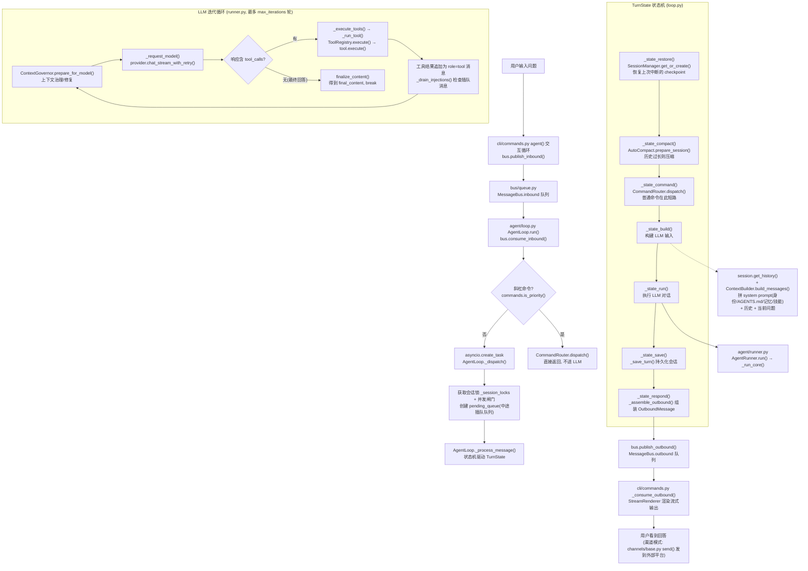

# nanobot 项目概览引导（第一版）

> 面向初次深入本项目的读者：以「用户输入一个问题 → 内部流转 → 返回答案」为主线，
> 串起核心模块、关键函数与推荐阅读顺序。
>
> 适用代码版本：当前仓库根目录，`nanobot-learn` 分支基线 `93571149`。

---

## 1. CLI 入口与 Typer 路由

```
python -m nanobot agent -m "你好"
         │
         ▼
__main__.py: app()                                    # Typer 实例调用，内部解析 sys.argv
         │
         │  Typer 匹配到子命令 "agent"
         │  （由 commands.py 中的 @app.command() 注册）
         ▼
commands.py: agent(message="你好")                      # agent() 函数被触发
         │
         ├─ -m 有值 → 单次模式: agent_loop.process_direct()
         └─ -m 无值 → 交互模式: agent_loop.run() + bus 循环
```

`app` 是 `typer.Typer` 对象，**调用 `app()` 不是跳转到变量定义那行，而是 Typer 框架接管命令行解析**，
根据参数自动分发到对应装饰器注册的函数：

| 命令行 | 装饰器 | 函数 | 文件行号 |
|---|---|---|---|
| `nanobot onboard` | `@app.command()` | `onboard()` | commands.py:636 |
| `nanobot agent` | `@app.command()` | `agent()` | commands.py:2174 |
| `nanobot gateway` | `app.add_typer()` | `create_gateway_app()` | commands.py:2153 / cli/gateway.py:37 |

---

## 2. 三层架构

```
渠道层 (channels / cli)  →  消息总线 (bus/queue.py)  →  智能体核心 (agent/loop.py + runner.py)
```

渠道与核心完全解耦：

1. **渠道层**：把外部平台（CLI、Telegram、飞书……）的消息包装成 `InboundMessage` 放入总线。
2. **消息总线**：`MessageBus` 内部是两条 `asyncio.Queue`（inbound / outbound）。
3. **智能体核心**：`AgentLoop` 消费入站消息、构建上下文、驱动状态机；`AgentRunner` 执行 LLM 多轮对话与工具调用；结果包装成 `OutboundMessage` 放回总线，由渠道取走展示。

### 2.1 深入：消息总线（MessageBus）是如何构建的

**① 类本身极简**（`nanobot/bus/queue.py`，约 40 行）：

```python
class MessageBus:
    def __init__(self):
        self.inbound: asyncio.Queue[InboundMessage] = asyncio.Queue()
        self.outbound: asyncio.Queue[OutboundMessage] = asyncio.Queue()
```

只有两条 `asyncio.Queue` + 4 个异步方法（`publish_inbound` / `consume_inbound` / `publish_outbound` / `consume_outbound`）。
无锁、无路由逻辑、无线程——完全依赖 asyncio 单事件循环内的队列语义保证安全。

**② 消息载体是 dataclass**（`nanobot/bus/events.py`）：

- `InboundMessage`：`channel` / `sender_id` / `chat_id` / `content` / `media` / `metadata`；
  `session_key` 属性自动拼为 `"{channel}:{chat_id}"`（会话隔离的基础）。
- `OutboundMessage`：`channel` / `chat_id` / `content` / `event` / `metadata`；
  `event` 字段携带结构化流式事件（`StreamDeltaEvent`、`StreamEndEvent`、`StreamedResponseEvent` 等，
  定义在 `nanobot/bus/outbound_events.py`），让 CLI/WebUI 能渲染打字机效果。

**③ 进程级单实例，手工注入共享**：

每个进程启动时只 `MessageBus()` 一次（`gateway` / `agent` / `serve` 等命令各自创建），
然后**同一个引用**被注入到两侧：

```
cli/commands.py
    bus = MessageBus()
        ├─→ AgentLoop.from_config(config, bus, ...)   # 核心侧：消费 inbound，生产 outbound
        └─→ ChannelManager(config, bus, ...)          # 渠道侧：生产 inbound，消费 outbound
```

即"事实单例"，但靠依赖注入传递，而不是全局变量——方便测试时替换。

**④ 生产 / 消费关系**：

| 方向 | 生产者 | 消费者 |
|---|---|---|
| inbound（用户 → 核心） | 各渠道 `BaseChannel._handle_message()` / CLI 输入循环 | `AgentLoop.run()`（`bus.consume_inbound()`） |
| outbound（核心 → 用户） | `AgentLoop._dispatch()`（`bus.publish_outbound()`） | `ChannelManager` 分发循环 / CLI `_consume_outbound()` |

**⑤ 关键设计：总线不做路由**。

`MessageBus` 只有两条队列，不知道任何渠道的存在。路由发生在消费端：
`ChannelManager` 的消费循环取出 outbound 消息后，按 `msg.channel` 字段找到对应渠道实例调用 `send()`。
新增一个渠道时无需改动总线和核心——这正是解耦的价值所在。

---

## 3. 主流程图（以 CLI 交互模式为例）



---

## 4. 各阶段关键函数速查

| 阶段 | 入口函数 | 文件 |
|---|---|---|
| 程序入口 | `app()` → `agent()` | `nanobot/__main__.py`、`nanobot/cli/commands.py` |
| 消息入队 | `bus.publish_inbound()` | `nanobot/bus/queue.py` |
| 主消费循环 | `AgentLoop.run()` | `nanobot/agent/loop.py` |
| 任务分发 | `AgentLoop._dispatch()` | `nanobot/agent/loop.py` |
| 状态机驱动 | `AgentLoop._process_message()` | `nanobot/agent/loop.py` |
| 上下文构建 | `ContextBuilder.build_messages()` / `build_system_prompt()` | `nanobot/agent/context.py` |
| LLM 迭代核心 | `AgentRunner._run_core()` | `nanobot/agent/runner.py` |
| 调用 LLM | `_request_model()` → `provider.chat_*_with_retry()` | `nanobot/agent/runner.py` → `nanobot/providers/` |
| 执行工具 | `_execute_tools()` → `_run_tool()` → `tool.execute()` | `nanobot/agent/runner.py` → `nanobot/agent/tools/` |
| 会话持久化 | `_save_turn()` → `SessionManager.save()` | `nanobot/agent/loop.py` → `nanobot/session/manager.py` |
| 响应出站 | `bus.publish_outbound()` / `BaseChannel.send()` | `nanobot/bus/queue.py` / `nanobot/channels/base.py` |

---

## 5. 值得注意的设计点

1. **状态机模式**：`_process_message()` 用 `TurnState` 枚举 + `_TRANSITIONS` 转换表驱动，每个状态对应一个 `_state_xxx()` 方法，流程清晰易读。
2. **双模式入口**：`nanobot agent -m "问题"` 走 `process_direct()` 直连（跳过总线）；交互模式和 gateway 模式走消息总线。
3. **中途注入**：一次回答生成期间用户再发消息，进入 `_pending_queues`，由 runner 的 `_drain_injections()` 在迭代间隙消费，而不是另起任务。
4. **工具循环**：LLM 返回 `tool_calls` 就执行工具、把结果塞回消息列表、再调 LLM，直到模型给出纯文本回答或达到 `max_iterations`。
5. **断点恢复**：每轮迭代通过 `_emit_checkpoint()` 写 checkpoint；`/stop` 或崩溃后，下一轮 `_state_restore` 可恢复部分上下文。

---

## 6. 推荐阅读顺序

1. `nanobot/bus/queue.py` — 约 40 行，最简单的起点。
2. `nanobot/cli/commands.py` 的 `agent()` — 看用户输入如何入队、出站如何渲染。
3. `nanobot/agent/loop.py` 的 `AgentLoop.run()` → `_dispatch()` → `_process_message()` 状态机。
4. `nanobot/agent/runner.py` 的 `_run_core()` — LLM + 工具的多轮迭代核心。
5. `nanobot/agent/context.py` 的 `build_messages()` / `build_system_prompt()` — 上下文如何拼装。
6. 后续按需深入：工具注册加载（`agent/tools/loader.py`）、记忆 Dream 压缩（`agent/memory.py`）、子代理（`agent/subagent.py`）、渠道接入（`channels/base.py`）、网关（`gateway/service.py`）。

---

## 7. 相关文档

- 架构总览：[architecture.md](../docs/architecture.md)
- 核心概念：[concepts.md](../docs/concepts.md)
- 配置说明：[configuration.md](../docs/configuration.md)
- CLI 参考：[cli-reference.md](../docs/cli-reference.md)
